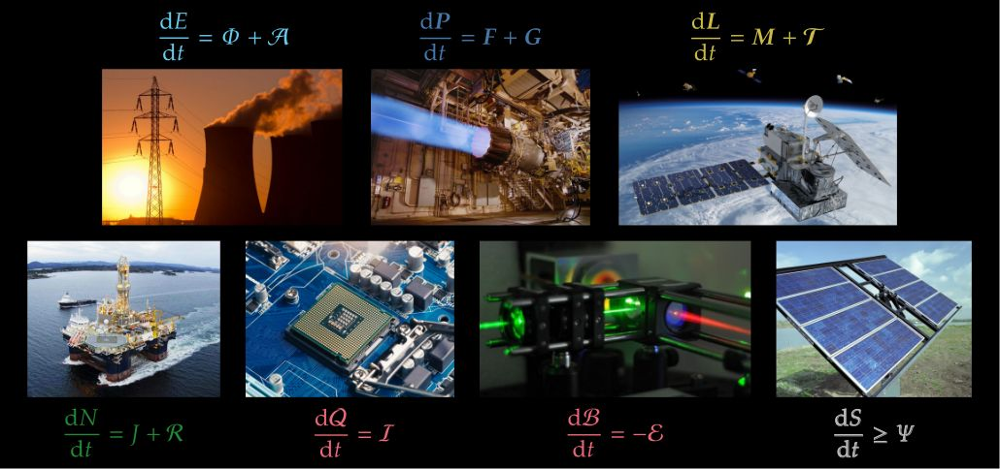

# The Seven Wonders of the World

Lecture notes on mechanics, thermodynamics, electromagnetism, at an undergraduate level. They take a simplified point of view from general relativity and continuum thermomechanics.

Current working draft at [https://pglpm.github.io/7wonders/](https://pglpm.github.io/7wonders/)

